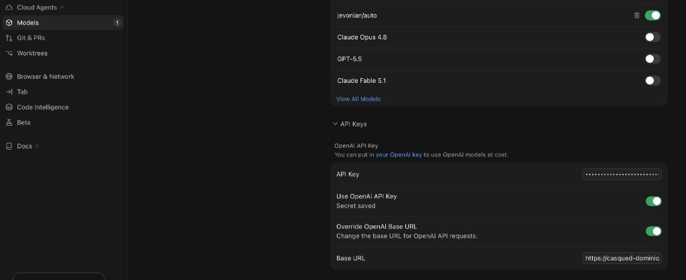

# Jevonian

**One local endpoint. The right model for every turn — enforced in code, not prompts.**

Coding agents burn budget when tool loops run on frontier models, and they break when cheap models attempt architecture. Jevonian sits locally between your agent and your providers: it routes each turn to the most cost-effective capable model, manages quota and cache economics, and logs every decision to a local ledger.

Keep your agent. Stop switching models by hand.

```text
Your agent (Claude Code / Cursor / Codex)
      ↓   point it at http://127.0.0.1:8787/v1
   Jevonian — local runtime
      ├─ plan      "design the auth migration"     → openai/gpt-6-astra           effort: high
      ├─ execute   "run the tests, fix failures"   → deepseek/deepseek-v4.1-flash
      ├─ utility   "summarize this diff"           → google/gemini-3.8-flash
      └─ chat      "thanks, that works"            → google/gemini-3.8-flash
      ↓
Every turn recorded: provider, actual tokens, cache affinity, estimated cost, and why.
```

Status: **v0.** Transparent pass-through, phase-based automatic routing, a local cost ledger, and subscription providers (API keys or OAuth sign-ins) with live quota meters.

- [Why Jevonian](#why-jevonian)
- [How it works](#how-it-works)
- [Quickstart](#quickstart)
- [Connect your agent](#connect-your-agent)
- [Clients and providers](#clients-and-providers)
- [Control and visibility](#control-and-visibility)
- [Privacy and limitations](#privacy-and-limitations)
- [Documentation](#documentation)
- [Development](#development)

## Why Jevonian

**Less manual switching.** Planning, implementation, background calls and small talk want different models. Jevonian decides per turn, so you stop changing the model picker between a design discussion and a failing test.

**Use the capacity you already have.** API keys and subscriptions — Claude Pro/Max, ChatGPT Codex, OpenCode Go, Command Code — sit behind one endpoint. Routing accounts for remaining quota, so a spent window moves work instead of failing the turn.

**See what actually happened.** Every request reports the model and provider that served it, the reason for the choice, the thinking level actually sent, real token usage, cache reads, and an estimated cost. Nothing is inferred from task counts.

Jevonian routes requests. It does not decompose tasks, manage worktrees, or accept code on your behalf — your agent owns its workflow.

## How it works

```text
your coding agent  →  Jevonian (127.0.0.1)  →  configured providers  →  response + routing record
```

Each turn takes one of three paths:

1. **Code narrows the candidates.** Configuration, wire protocol, quota health, context window, and thinking-level floor are arithmetic, applied before any model judgement.
2. **Jev picks the route** for `jevonian/auto` — model and thinking depth in a single call.
3. **The proxy forwards the request** and records usage, reason, and result in the ledger.

The request path is decided by precedence, not by guesswork:

| You send                                         | What happens                                     |
| ------------------------------------------------ | ------------------------------------------------ |
| `jevonian/auto`                                  | one Jev call picks the route from the candidates |
| `jevonian/plan` / `execute` / `utility` / `chat` | that route is used; Jev is not consulted         |
| `x-jevonian-phase: plan`                         | explicit override, same as the alias above       |
| a real model ID                                  | pinned to that model, never routed               |
| `routing.mode: "off"`                            | pure pass-through; virtual models are rejected   |

Automatic routing needs a brain. With none configured, `jevonian/auto` returns an error rather than guessing, and if every configured brain is unreachable the request fails with `502`.

### The brain: TypeSafe Jev

Jevonian doesn't use a slow LLM prompt or fragile JSON extraction to make routing decisions. Instead, its routing intelligence is powered by **Jev**, the fast decision model behind [TypeSafe](https://typesafe.ai)'s System One architecture (available directly via TypeSafe, OpenRouter as `typesafe/jev-1.13`, OpenCode Zen, or Vercel AI Gateway).

- **Purpose-built for decision-making**: Rather than generating conversational prose, Jev evaluates a structured snapshot of session state (user intent, tool results, consecutive error counts, context headroom, candidate capabilities, and cache switch penalties) against discrete routing criteria.
- **Single round-trip consultation**: One API call answers both _which route_ and _how deeply to think_. The compact state representation isolates the decision from long conversation histories while keeping the turn responsive.
- **Calibrated probabilities**: Jev provides calibrated probability distributions and confidence scores across candidate options. `minConfidence` marks a turn as low-confidence in the ledger and response headers; secondary brain channels are only tried when the primary channel fails, not when confidence is low. See [docs/brain.md](docs/brain.md) for channel setup and state payloads.

## Quickstart

Requires **Node 22+**.

```bash
npm install --global jevonian
jevonian
```

Or with pnpm: `pnpm add --global jevonian`. That serves the proxy and dashboard together on `http://127.0.0.1:8787` and opens the browser. Then:

1. **Add a provider** on the **Providers** page and paste its API key. Keys are stored in `~/.config/jevonian/credentials.json` with `0600` permissions.
2. **Add a brain** on the same page. Automatic routing needs one; pick the channel you already pay for.
3. **Generate a Jevonian API key** on the **Keys** page (`sk-jev-…`, shown once, stored hashed). Optionally set a **credit limit** so estimated pay-as-you-go spend cannot exceed a total USD ceiling; see [keys.md](docs/keys.md).
4. **Point an agent at** `http://127.0.0.1:8787/v1` using that key, with the model `jevonian/auto`.

Confirm the first turn in **Logs**: it should show the phase, the model and provider that actually served it, and the routing reason. A running server is not proof the agent is connected. Use **Activity** for spend / token / request charts per key.

`--no-open` (or `JEVONIAN_NO_OPEN=1`) skips launching the browser. For a CLI-first path, `jevonian init` and `jevonian add` do the same setup without the dashboard:

```bash
jevonian add openrouter --key sk-or-...
jevonian report
```

While no Jevonian key exists, the proxy stays open for first-run convenience. Once one exists, all `/v1/*` traffic must carry it as `authorization: Bearer …` or `x-api-key`.

## Connect your agent

Every client below ends up talking to the same endpoint with a Jevonian key (`sk-jev-…`) and the model `jevonian/auto`. The only difference is how each one is pointed at it.

### Cursor

Cursor runs in the cloud and only accepts a **public HTTPS** URL for a custom OpenAI endpoint, so `http://127.0.0.1:8787/v1` will not work — you need a tunnel. Jevonian's tunnel is an explicit opt-in that publishes nothing but `/v1`:

1. Generate a key on the **Keys** page first. A tunnel cannot start while no Jevonian key exists.
2. On the **Overview** page, open **Public tunnel**, pick a provider, and press **Start tunnel** (or run `jevonian serve --tunnel` to force it on for one run).
   - `cloudflare` — quick tunnel, no account needed; gives a random `*.trycloudflare.com` URL.
   - `ngrok` — run `ngrok config add-authtoken` once, then paste a reserved domain to keep a stable address (recommended for Cursor).
3. Copy the public URL and append `/v1` — that is the Base URL Cursor needs. The tunnel's URL survives server restarts (including `pnpm dev` HMR) until you press **Stop tunnel**, so you do not have to re-paste it every session.
4. In Cursor, open **Settings → Models → API Keys** and fill it in:

| Field                        | Value                                     |
| ---------------------------- | ----------------------------------------- |
| **API Key**                  | the Jevonian key from step 1 (`sk-jev-…`) |
| **Use OpenAI API Key**       | on                                        |
| **Override OpenAI Base URL** | on                                        |
| **Base URL**                 | `https://<your-tunnel-host>/v1`           |

5. Add the model `jevonian/auto` to your model list and enable it (leave the other models toggled off if you want Jevonian to serve everything).



That is the whole setup: Cursor sends OpenAI Chat Completions to the tunnel, Jevonian picks the route per turn, and each request shows up in **Logs** with the phase, the model that actually served it, and the reason. If a turn fails, check the tunnel status and the **Logs** page before touching Cursor's settings again.

### Claude Code and Claude Desktop

Both surfaces are covered by one **Connect Claude** action on the **Clients** page: it rewrites Claude Desktop's third-party gateway profile and Claude Code's `~/.claude/settings.json`, and **Restore** puts them back. For a one-shot session that changes nothing on disk:

```bash
jevonian launch claude
jevonian launch claude --model jevonian/auto -- -p "summarize this repo"
```

### ChatGPT / Codex

**Connect ChatGPT** on the **Clients** page writes `~/.codex/config.toml` (`openai_base_url` plus an injected model catalog) and points the Codex desktop app at the loopback endpoint. An existing `auth.json` login is never overwritten.

### Anything else

Any client speaking OpenAI Chat Completions, Anthropic Messages, or OpenAI Responses can be configured by hand:

```bash
export OPENAI_BASE_URL=http://127.0.0.1:8787/v1
export OPENAI_API_KEY=sk-jev-…
# then select the model jevonian/auto
```

See [tunnel.md](docs/tunnel.md) for the tunnel's providers and security notes, and [cli.md](docs/cli.md) for the launch commands.

## Clients and providers

Two separate questions: where you run the agent, and where the tokens finally go.

**Clients.** Any client speaking the OpenAI Chat Completions, Anthropic Messages, or OpenAI Responses protocol can point at `http://127.0.0.1:8787/v1`. Those are the three shapes Jevonian parses and rewrites; compatibility of a specific client's own extras is not implied by protocol support.

**Providers.** Presets ship for DeepSeek, Anthropic, OpenAI, Moonshot (Kimi), Z.ai (GLM), MiniMax, Alibaba Qwen, xAI (Grok), Google Gemini, OpenRouter, OrcaRouter, OpenCode Go, Command Code, and custom endpoints. Two families are worth distinguishing:

- **API key** — pay-per-token, `billing: "api"`.
- **Subscription** — flat-rate or quota-based, `billing: "subscription"`. Either an API-key subscription (`opencode-go`, `commandcode`) or an OAuth subscription whose credential already lives on your machine:

| Subscription     | Credential source                                   | Wire                        |
| ---------------- | --------------------------------------------------- | --------------------------- |
| Claude Pro/Max   | `~/.claude/.credentials.json` or the macOS keychain | Anthropic Messages (Bearer) |
| ChatGPT Plus/Pro | `~/.codex/auth.json`                                | OpenAI Responses            |
| Antigravity      | local IDE token and project id                      | Gemini / Cloud Code Assist  |

OAuth tokens are read on demand, refreshed when near expiry, and rotated tokens are written back so Claude Code and Codex keep working. Subscription access through third-party clients sits outside the vendors' official clients: it can break when upstream headers change, and it is used at your own risk.

The same model is often spelled differently per provider. Jevonian normalizes those spellings into canonical ids, so a route can name `claude-sonnet-4.6` once and let routing resolve it across every provider that serves it — including the official id a vendor uses instead. See [routing.md](docs/routing.md#canonical-models).

## Control and visibility

**Routing controls.** Routes are named categories — `plan`, `execute`, `utility`, `chat` — each holding an ordered model list. Configure them on the **Routing** page or in `routing.routings`. Request a route explicitly with `jevonian/<id>`, or force a thinking floor with `x-jevonian-effort: high`.

**Quota and cache awareness.** A provider that has spent its window is removed from the candidate list before any model judgement. Cache evidence — recent measured hit ratio, estimated cached/uncached input, input-cost difference versus staying on the previous model — is included in the state sent to Jev. Unknown quota is treated as neutral, never as a blocker.

**Request evidence.** Every response carries the decision:

| Header                | Meaning                                            |
| --------------------- | -------------------------------------------------- |
| `x-jevonian-model`    | the model that actually served the turn            |
| `x-jevonian-provider` | the provider that served it                        |
| `x-jevonian-phase`    | the route used                                     |
| `x-jevonian-reason`   | why it was chosen, including any skips or clamping |
| `x-jevonian-effort`   | the thinking level actually sent                   |
| `x-jevonian-skipped`  | every model withheld, and the reason               |

The same data lands in the ledger and the dashboard: spend, cache reads, latency, brain-decided turns, and estimated savings against the baseline model. Thinking level is read back from the outgoing body, so a level your client set for itself is reported rather than silently overridden.

Each of these carries a boundary worth knowing up front:

- A pinned **model** is not necessarily a pinned **provider** — several providers may serve the same model.
- A session keeps its route until Jev moves it or the session TTL expires. It is affinity, not a task-level lock.
- Cache figures are **estimates**; the on-wire prefix is not yet compared, so `prefixMatch` stays `unknown`.
- Costs are **estimated** from the price table, not read back from a vendor invoice.
- Savings compare against a configured baseline model, not a controlled experiment.

## Privacy and limitations

Local-first means the **server** is local. It does not mean inference happens on your machine: prompts, tool results, and file contents go to whichever provider serves the turn.

- **The brain sees context too.** The compact state includes the last user message, recent messages, recent tool calls and results, and the candidate list. `fullPrompt: true` sends a verbatim transcript, capped at 400k characters. Pick that deliberately.
- **Request bodies are stored locally** for the log detail view (`~/.local/share/jevonian/bodies/`, `0600`, newest 1000 kept). Set `JEVONIAN_CAPTURE_BODIES=0` to stop storing them.
- **Credentials** live in `~/.config/jevonian/credentials.json` (`0600`) or an environment variable you name.
- **The tunnel** exposes only `/v1` and `/healthz` through a separate loopback listener; the dashboard and admin API are never published, and a tunnel cannot start while no Jevonian key exists.
- **Subscriptions** are used through third-party clients, outside the vendors' official ones.

Jevonian makes no claim about model quality, and does not gate or accept code. It decides where a turn goes and records what happened.

## Documentation

| Document                                      | Contents                                                         |
| --------------------------------------------- | ---------------------------------------------------------------- |
| [routing.md](docs/routing.md)                 | Routes, precedence, context and effort filtering, quota, cache   |
| [brain.md](docs/brain.md)                     | Jev channels, the state it receives, confidence and fallback     |
| [providers.md](docs/providers.md)             | Provider fields, canonical models, subscriptions, usage & limits |
| [configuration.md](docs/configuration.md)     | Full `config.json` reference, env vars, data locations           |
| [cli.md](docs/cli.md)                         | Every command and flag                                           |
| [tunnel.md](docs/tunnel.md)                   | Exposing the endpoint to cloud runners and remote editors        |
| [development.md](docs/development.md)         | Layout, build, tests, release process                            |
| [troubleshooting.md](docs/troubleshooting.md) | Symptoms, causes, and what to check first                        |

## Development

Built with [Vite+](https://viteplus.dev); Oxlint, Oxfmt, Vitest, and tsdown come from the `vite-plus` bundle. From a source checkout:

```bash
pnpm install
pnpm dev           # Vite dev server (5173) + proxy (8787), HMR, opens the dashboard
vp check           # format + lint + type check (primary gate; --fix to apply)
vp test            # unit tests
pnpm smoke         # end-to-end assertions against a mock upstream, no API keys needed
pnpm build         # bundle the CLI and build the web UI
```

See [development.md](docs/development.md) for the source layout and the release process.

## License

[AGPL-3.0-only](LICENSE). Copyright (C) 2026 xinyao.
