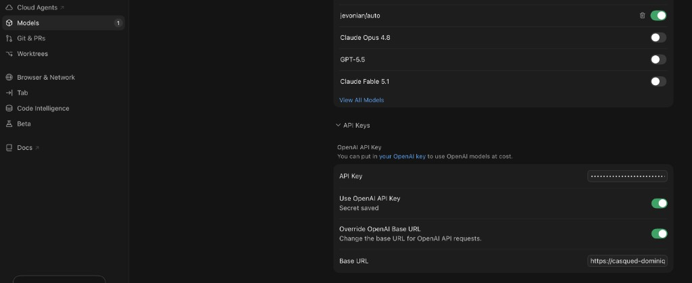

# Jevonian

### The right model for every turn. One local endpoint.

Keep the coding agent you already use. Jevonian sits between your agent and your providers, chooses a capable model for each turn, respects quota and cache economics, and records the decision locally. No manual model switching between planning, implementation, and smaller tasks.

**[Get started](#quickstart) · [Connect an agent](#connect-your-agent) · [See how routing works](#how-it-works)**

```text
Claude Code / Cursor / Codex
              │
              ▼
    Jevonian · 127.0.0.1:8787/v1
              │
       ┌──────┼──────┐
       ▼      ▼      ▼
     plan  execute  utility / chat
       │      │      │
       └──────┼──────┘
              ▼
    Your configured providers
              │
              ▼
    Local ledger: model · tokens · cost · reason
```

> **What it is:** A local model router and protocol gateway. **What it is not:** An agent, a task manager, or a promise of local inference. Your agent owns the workflow; your selected provider runs the model.

**Start in two commands** (Node 22+):

```bash
npm install --global jevonian
jevonian
```

Open `http://127.0.0.1:8787`, add a provider and a routing brain, then connect your agent with a Jevonian API key and `jevonian/auto`. The [quickstart](#quickstart) walks through each step.

**Upgrading from 0.5.x:** `npm i -g jevonian@latest`, then run `jevonian` (or `jevonian restart`). The first Go release may leave a macOS LaunchAgent pointed at the deleted Node entry — a current build rewrites it automatically; if an older 0.6.0 still refuses, run `jevonian stop --uninstall && jevonian start`. See [troubleshooting.md](docs/troubleshooting.md#macos-service-will-not-start-after-upgrading-to-go-06).

**Explore:** [Why Jevonian](#why-jevonian) · [How it works](#how-it-works) · [Quickstart](#quickstart) · [Connect your agent](#connect-your-agent) · [Clients and providers](#clients-and-providers) · [Control and visibility](#control-and-visibility) · [Privacy and limitations](#privacy-and-limitations) · [Documentation](#documentation) · [Development](#development)

Status: **v0.** Transparent pass-through, phase-based automatic routing, a local cost ledger, and subscription providers (API keys or OAuth sign-ins) with live quota meters.

## Why Jevonian

### One endpoint, several jobs

Planning, implementation, background calls, and small talk need different levels of capability. `jevonian/auto` picks a route for each turn; explicit routes and pinned models remain available when you want control.

### Your providers, one place

API keys and subscriptions — Claude Pro/Max, ChatGPT Codex, Antigravity, Devin, OpenCode Go, Command Code — sit behind the same local endpoint. Quota-aware routing avoids exhausted providers before sending a request.

### The decision is visible

Each request reports the model and provider that served it, the routing reason, the thinking level actually sent, token usage, cache reads, and an estimated cost. The local ledger lets you inspect what happened instead of guessing from task counts.

Jevonian routes requests. It does not decompose tasks, manage worktrees, or accept code on your behalf — your agent owns its workflow.

## How it works

```text
your coding agent  →  Jevonian (127.0.0.1)  →  configured providers  →  response + routing record
```

Each turn takes one of three paths:

1. **Code narrows the candidates.** Configuration, wire protocol, quota health, context window, and thinking-level floor are arithmetic, applied before any model judgement.
2. **Jev picks the route** for `jevonian/auto` — model and thinking depth in a single call.
3. **The proxy forwards the request** and records usage, reason, and result in the ledger.

The request path is decided by precedence, not by guesswork:

| You send                                         | What happens                                     |
| ------------------------------------------------ | ------------------------------------------------ |
| `jevonian/auto`                                  | one Jev call picks the route from the candidates |
| `jevonian/plan` / `execute` / `utility` / `chat` | that route is used; Jev is not consulted         |
| `x-jevonian-phase: plan`                         | explicit override, same as the alias above       |
| a real model ID                                  | pinned to that model, never routed               |
| `routing.mode: "off"`                            | pure pass-through; virtual models are rejected   |

Automatic routing needs a brain. With none configured, `jevonian/auto` returns an error rather than guessing. If every configured brain remains unreachable after retries, the turn falls back to heuristic phase classification.

### The brain: TypeSafe Jev

Jevonian doesn't use a slow LLM prompt or fragile JSON extraction to make routing decisions. Instead, its routing intelligence is powered by **Jev**, the fast decision model behind [TypeSafe](https://typesafe.ai)'s System One architecture (available directly via TypeSafe, OpenRouter as `typesafe/jev-1.13`, OpenCode Zen, Vercel AI Gateway, or Cloudflare Workers AI — where Cloudflare's Jev-API-compatible **Clef** and **Clef-flash** models can serve the same role as a drop-in).

- **Purpose-built for decision-making**: Rather than generating conversational prose, Jev evaluates a structured snapshot of session state (user intent, tool results, consecutive error counts, context headroom, candidate capabilities, and cache switch penalties) against discrete routing criteria.
- **Single round-trip consultation**: One API call answers both _which route_ and _how deeply to think_. The compact state representation isolates the decision from long conversation histories while keeping the turn responsive.
- **Calibrated probabilities**: Jev provides calibrated probability distributions and confidence scores across candidate options. `minConfidence` marks a turn as low-confidence in the ledger and response headers; secondary brain channels are only tried when the primary channel fails, not when confidence is low. See [docs/brain.md](docs/brain.md) for channel setup and state payloads.

## Quickstart

Requires **Node 22+**.

```bash
npm install --global jevonian
jevonian
```

Or with pnpm: `pnpm add --global jevonian`.

On **macOS**, `jevonian` installs a LaunchAgent and keeps the proxy running in the background (survives terminal exit and reboots). On other platforms it serves in the foreground. Dashboard: `http://127.0.0.1:8787`.

| Command                     | What it does                            |
| --------------------------- | --------------------------------------- |
| `jevonian`                  | Start / ensure the proxy is running     |
| `jevonian start`            | Same as bare `jevonian` (macOS)         |
| `jevonian status`           | Show pid and recent log (macOS)         |
| `jevonian stop`             | Stop the background service (macOS)     |
| `jevonian restart`          | Restart the background service (macOS)  |
| `jevonian stop --uninstall` | Stop and remove the LaunchAgent (macOS) |
| `jevonian --foreground`     | Run attached in this terminal instead   |

Then:

1. **Add a provider** on the **Providers** page and paste its API key. Keys are stored in `~/.config/jevonian/credentials.json` with `0600` permissions.
2. **Add a brain** on the same page. Automatic routing needs one; pick the channel you already pay for.
3. **Generate a Jevonian API key** on the **Keys** page (`sk-jev-…`, shown once, stored hashed). Optionally set a **credit limit** so estimated pay-as-you-go spend cannot exceed a total USD ceiling; see [keys.md](docs/keys.md).
4. **Point an agent at** `http://127.0.0.1:8787/v1` using that key, with the model `jevonian/auto`.

Confirm the first turn in **Logs**: it should show the phase, the model and provider that actually served it, and the routing reason. A running server is not proof the agent is connected. Use the **Activity** section on **Overview** for spend / token / request charts per key.

`--no-open` (or `JEVONIAN_NO_OPEN=1`) skips launching the browser. For a CLI-first path, `jevonian init` and `jevonian add` do the same setup without the dashboard:

```bash
jevonian add openrouter --key sk-or-...
jevonian report
```

While no Jevonian key exists, the proxy stays open for first-run convenience. Once one exists, all `/v1/*` traffic must carry it as `authorization: Bearer …` or `x-api-key`.

## Connect your agent

Every client below ends up talking to the same endpoint with a Jevonian key (`sk-jev-…`) and the model `jevonian/auto`. The only difference is how each one is pointed at it.

### Quick start: Claude Code, OpenCode and PI Agent

The shortest working path for each client, run on a clean config. The commands are the same on Windows, macOS and Linux. Add `JEVONIAN_PORT=<port>` in front of every `jevonian` command (or set it once) to use a port other than 8787.

**Install.** `npm install --global jevonian` is enough once a release has the fixes from this branch (Claude login on Sonnet and Opus, Windows start-up). Until then, build it (about 20 seconds with warm caches; needs Node 22+, pnpm and Go 1.26+):

```bash
git clone --branch feat/routing-schedule https://github.com/piratchai/jevonian.git
cd jevonian && pnpm install --frozen-lockfile && pnpm web:build
go build -o jevonian ./cmd/jevonian        # on Windows: -o jevonian.exe
```

**Claude Code, on your Claude login (no other account).** Do not run `jevonian init` first: its example config adds a DeepSeek provider.

```bash
jevonian add claude-subscription
jevonian serve --foreground                 # leave this running; open another terminal
jevonian launch claude --model jevonian/execute
```

`jevonian/auto` needs a [routing brain](docs/brain.md), so start from an explicit route as above. See "With only a Claude login and no routing brain" below.

**OpenCode and PI Agent, on an API-key provider** (the example is an OpenAI-compatible Alibaba endpoint; any provider works):

```bash
export ALIBABA_API_KEY=...                  # Windows cmd: set ALIBABA_API_KEY=...
jevonian add custom --name alibaba --type openai --env ALIBABA_API_KEY \
  --base-url https://token-plan.ap-southeast-1.maas.aliyuncs.com/compatible-mode/v1 \
  --models qwen3.6-flash,qwen3.7-plus
jevonian serve --foreground                 # leave this running; the key variable must be set here too
jevonian keys create opencode               # prints sk-jev-... once; make one more for pi
```

Then give each client its key and the endpoint, as in the OpenCode and PI Agent sections below, and ask for `jevonian/execute`:

```bash
opencode run -m jevonian/execute "explain this repo"      # a project opencode.json works as well as the global one
pi --provider jevonian --model jevonian/execute -p "explain this repo"
```

If a thinking model fails with `max_completion_tokens must be greater than thinking_budget`, add `"defaultEffort": "low"` under `routing` in the config file and restart `serve`.

Check each first turn in **Logs** on that instance's dashboard: it shows the model and provider that served it.

### Cursor

Cursor runs in the cloud and only accepts a **public HTTPS** URL for a custom OpenAI endpoint, so `http://127.0.0.1:8787/v1` will not work — you need a tunnel. Jevonian's tunnel is an explicit opt-in that publishes nothing but `/v1`:

1. Generate a key on the **Keys** page first. A tunnel cannot start while no Jevonian key exists.
2. On the **Overview** page, open **Public tunnel**, pick a provider, and press **Start tunnel** (or run `jevonian serve --tunnel` to force it on for one run).
   - `cloudflare` — quick tunnel, no account needed; gives a random `*.trycloudflare.com` URL.
   - `ngrok` — run `ngrok config add-authtoken` once, then paste a reserved domain to keep a stable address (recommended for Cursor).
3. Copy the public URL and append `/v1` — that is the Base URL Cursor needs. The tunnel's URL survives server restarts (including `pnpm dev` HMR) until you press **Stop tunnel**, so you do not have to re-paste it every session.
4. In Cursor, open **Settings → Models → API Keys** and fill it in:

| Field                        | Value                                     |
| ---------------------------- | ----------------------------------------- |
| **API Key**                  | the Jevonian key from step 1 (`sk-jev-…`) |
| **Use OpenAI API Key**       | on                                        |
| **Override OpenAI Base URL** | on                                        |
| **Base URL**                 | `https://<your-tunnel-host>/v1`           |

5. Add the model `jevonian/auto` to your model list and enable it (leave the other models toggled off if you want Jevonian to serve everything).



That is the whole setup: Cursor sends OpenAI Chat Completions to the tunnel, Jevonian picks the route per turn, and each request shows up in **Logs** with the phase, the model that actually served it, and the reason. If a turn fails, check the tunnel status and the **Logs** page before touching Cursor's settings again.

### Claude Code and Claude Desktop

Both surfaces are covered by one **Connect Claude** action on the **Clients** page: it rewrites Claude Desktop's third-party gateway profile and Claude Code's `~/.claude/settings.json`, and **Restore** puts them back. For a one-shot session that changes nothing on disk:

```bash
jevonian launch claude
jevonian launch claude --model jevonian/auto -- -p "summarize this repo"
```

**With only a Claude login and no routing brain.** `launch claude` starts on `jevonian/auto`, and `auto` needs a [routing brain](docs/brain.md). Without one, the router answers HTTP 400 ("No Jev brain is configured"), and Claude Code only prints an `unrecognized_model` warning. Start from an explicit route instead:

```bash
jevonian add claude-subscription        # do not run `jevonian init` first: its example config adds a DeepSeek provider
jevonian serve
jevonian launch claude --model jevonian/execute
```

`jevonian/execute` serves the Opus, Sonnet and subagent slots, and `jevonian/utility` serves the Haiku slot. The routes that `add` picks are the strongest Claude models for every task (for example Fable for utility and chat). To spend less, set Plan to Opus, Execute to Sonnet, and Utility and Chat to Haiku under **Models & Routing**. Claude plans cost the same at every hour, so the **Schedule** card is hidden when every provider is a Claude login.

### ChatGPT / Codex

**Connect ChatGPT** on the **Clients** page writes `~/.codex/config.toml` (`openai_base_url` plus an injected model catalog) and points the Codex desktop app at the loopback endpoint. An existing `auth.json` login is never overwritten.

### OpenCode

OpenCode v2 reads providers from `~/.config/opencode/opencode.json`. Create a key on the **Keys** page first. With a Jevonian key, the bare route names (`plan`, `execute`, `utility`, `chat`, `auto`) all route. Without one, only `auto` and `jevonian/*` names route; any other name is treated as a native OpenAI model.

```json
{
  "providers": {
    "jevonian": {
      "package": "@opencode/ai/providers/openai-compatible",
      "settings": { "baseURL": "http://127.0.0.1:8787/v1", "apiKey": "sk-jev-…" },
      "models": {
        "auto": {
          "name": "Jevonian Auto",
          "package": "@opencode/ai/providers/openai-compatible",
          "capabilities": { "tools": true, "input": ["text"], "output": ["text"] }
        },
        "plan": {
          "name": "Jevonian Plan",
          "package": "@opencode/ai/providers/openai-compatible",
          "capabilities": { "tools": true, "input": ["text"], "output": ["text"] }
        },
        "execute": {
          "name": "Jevonian Execute",
          "package": "@opencode/ai/providers/openai-compatible",
          "capabilities": { "tools": true, "input": ["text"], "output": ["text"] }
        },
        "utility": {
          "name": "Jevonian Utility",
          "package": "@opencode/ai/providers/openai-compatible",
          "capabilities": { "tools": true, "input": ["text"], "output": ["text"] }
        },
        "chat": {
          "name": "Jevonian Chat",
          "package": "@opencode/ai/providers/openai-compatible",
          "capabilities": { "tools": true, "input": ["text"], "output": ["text"] }
        }
      }
    }
  }
}
```

Then run `opencode run -m jevonian/auto "…"`.

### PI Agent

PI Agent reads `~/.pi/agent/models.json` (or the folder in `PI_CODING_AGENT_DIR`). Point an OpenAI-compatible provider at Jevonian and give it a Jevonian key:

```json
{
  "providers": {
    "jevonian": {
      "baseUrl": "http://127.0.0.1:8787/v1",
      "api": "openai-completions",
      "apiKey": "$JEVONIAN_API_KEY",
      "models": [{ "id": "jevonian/auto" }, { "id": "jevonian/plan" }, { "id": "jevonian/execute" }]
    }
  }
}
```

Then run `pi --provider jevonian --model jevonian/auto`.

### One instance per client

By default every client shares the one Jevonian on port 8787. To give a client its own port, ledger and keys, run another instance with its own config file and data folder:

```bash
# macOS and Linux (bash, zsh)
export JEVONIAN_CONFIG=~/.config/jevonian/config-pi.json
export JEVONIAN_DATA_DIR=~/.local/share/jevonian-pi
export JEVONIAN_PORT=8788
jevonian serve --foreground
```

```bat
:: Windows (cmd)
set JEVONIAN_CONFIG=%USERPROFILE%\.config\jevonian\config-pi.json
set JEVONIAN_DATA_DIR=%USERPROFILE%\.local\share\jevonian-pi
set JEVONIAN_PORT=8788
jevonian serve --foreground
```

- The port is `listen.port` in that config file. `JEVONIAN_PORT` overrides it for the process, also when the config file does not exist yet. A command that rewrites the config (for example `jevonian add`) saves the port that is in effect, so the port you set while you run it is kept.
- `jevonian launch claude` reads the same config and variables, so set the same ones when you launch.
- **macOS:** plain `jevonian serve`, `start`, `stop` and `restart` manage one LaunchAgent that serves the default config. Start every extra instance with `serve --foreground`, as above, so the LaunchAgent is not touched; stop it with Ctrl+C. Linux and Windows have no background service, so `serve` always runs in the foreground there.
- **Linux and macOS:** the config and data folders are `$XDG_CONFIG_HOME/jevonian` and `$XDG_DATA_HOME/jevonian` when those variables are set, else `~/.config/jevonian` and `~/.local/share/jevonian`.
- The ledger, the logs and the Jevonian keys (`keys.json`) live in the data folder, so each instance has its own. Create one key per instance on its **Keys** page.
- Provider keys in `credentials.json` are shared by every instance, unless `JEVONIAN_CREDENTIALS` points somewhere else.
- Point each client's `baseURL` at the port of its own instance: `http://127.0.0.1:8788/v1` in the PI Agent example above.

### Anything else

Any client speaking OpenAI Chat Completions, Anthropic Messages, or OpenAI Responses can be configured by hand:

```bash
export OPENAI_BASE_URL=http://127.0.0.1:8787/v1
export OPENAI_API_KEY=sk-jev-…
# then select the model jevonian/auto
```

See [tunnel.md](docs/tunnel.md) for the tunnel's providers and security notes, and [cli.md](docs/cli.md) for the launch commands.

## Clients and providers

Two separate questions: where you run the agent, and where the tokens finally go.

**Clients.** Any client speaking the OpenAI Chat Completions, Anthropic Messages, or OpenAI Responses protocol can point at `http://127.0.0.1:8787/v1`. Those are the three shapes Jevonian parses and rewrites; compatibility of a specific client's own extras is not implied by protocol support.

**Providers.** Presets ship for DeepSeek, Anthropic, OpenAI, Moonshot (Kimi), Z.ai (GLM), MiniMax, Alibaba Qwen, xAI (Grok), Google Gemini, OpenRouter, OrcaRouter, OpenCode Go, Command Code, Claude Pro/Max, ChatGPT (Codex), Antigravity, Devin, and custom endpoints. Two families are worth distinguishing:

- **API key** — pay-per-token, `billing: "api"`.
- **Subscription** — flat-rate or quota-based, `billing: "subscription"`. Either an API-key subscription (`opencode-go`, `commandcode`) or an OAuth subscription whose credential already lives on your machine:

| Subscription     | Credential source                                   | Wire                        |
| ---------------- | --------------------------------------------------- | --------------------------- |
| Claude Pro/Max   | `~/.claude/.credentials.json` or the macOS keychain | Anthropic Messages (Bearer) |
| ChatGPT Plus/Pro | `~/.codex/auth.json`                                | OpenAI Responses            |
| Antigravity      | local IDE token and project id                      | Gemini / Cloud Code Assist  |
| Devin            | `~/.local/share/devin/credentials.toml`             | Devin Connect-RPC           |

OAuth tokens are read on demand, refreshed when near expiry, and rotated tokens are written back so Claude Code and Codex keep working. Subscription access through third-party clients sits outside the vendors' official clients: it can break when upstream headers change, and it is used at your own risk.

### Another Jevonian as a provider

One instance can route through another. Turn on **LAN access** on the machine that holds the credentials (Overview page, or `jevonian serve --lan`):

```
lan: listening on 0.0.0.0:8789 (only /v1, key required)
lan: provider base URL http://192.168.1.20:8789/v1
```

On the other machine, add a provider with that base URL and a Jevonian API key created on the first machine's **Keys** page — the `Jevonian (another machine)` preset pre-fills the shape. The two instances stay independent: the second only sees routed models and spends against the first instance's keys.

Only `/v1` is served on the LAN address; the dashboard and admin API stay on loopback, so a neighbour on the network can never edit providers or read keys. Every request still needs a Jevonian key, and the loopback-only desktop sentinel (`jevonian-local`) is rejected there. Keep it on a network you trust and rotate keys you have shared.

The same model is often spelled differently per provider. Jevonian normalizes those spellings into canonical ids, so a route can name `claude-sonnet-4.6` once and let routing resolve it across every provider that serves it — including the official id a vendor uses instead. See [routing.md](docs/routing.md#canonical-models).

## Control and visibility

**Routing controls.** Routes are named categories — `plan`, `execute`, `utility`, `chat` — each holding an ordered model list. Configure them on the **Routing** page or in `routing.routings`. Request a route explicitly with `jevonian/<id>`, or force a thinking floor with `x-jevonian-effort: high`.

**Quota and cache awareness.** A provider that has spent its window is removed from the candidate list before any model judgement. Cache evidence — recent measured hit ratio, estimated cached/uncached input, input-cost difference versus staying on the previous model — is included in the state sent to Jev. Unknown quota is treated as neutral, never as a blocker.

**Request evidence.** Every response carries the decision:

| Header                | Meaning                                            |
| --------------------- | -------------------------------------------------- |
| `x-jevonian-model`    | the model that actually served the turn            |
| `x-jevonian-provider` | the provider that served it                        |
| `x-jevonian-phase`    | the route used                                     |
| `x-jevonian-reason`   | why it was chosen, including any skips or clamping |
| `x-jevonian-effort`   | the thinking level actually sent                   |
| `x-jevonian-skipped`  | every model withheld, and the reason               |

The same data lands in the ledger and the dashboard: spend, cache reads, latency, brain-decided turns, and estimated savings against the baseline model. Thinking level is read back from the outgoing body, so a level your client set for itself is reported rather than silently overridden.

Each of these carries a boundary worth knowing up front:

- A pinned **model** is not necessarily a pinned **provider** — several providers may serve the same model.
- A session keeps its route until Jev moves it or the session TTL expires. It is affinity, not a task-level lock.
- Cache figures are **estimates**; the on-wire prefix is not yet compared, so `prefixMatch` stays `unknown`.
- Costs are **estimated** from the price table, not read back from a vendor invoice.
- Savings compare against a configured baseline model, not a controlled experiment.

## Privacy and limitations

Local-first means the **server** is local. It does not mean inference happens on your machine: prompts, tool results, and file contents go to whichever provider serves the turn.

- **The brain sees context too.** The compact state includes the last user message, recent messages, recent tool calls and results, and the candidate list. `fullPrompt: true` sends a verbatim transcript, capped at 400k characters. Pick that deliberately.
- **Request bodies are stored locally** for the log detail view (`~/.local/share/jevonian/bodies/`, `0600`, newest 1000 kept). Set `JEVONIAN_CAPTURE_BODIES=0` to stop storing them.
- **Credentials** live in `~/.config/jevonian/credentials.json` (`0600`) or an environment variable you name.
- **The tunnel** exposes only `/v1` and `/healthz` through a separate loopback listener; the dashboard and admin API are never published, and a tunnel cannot start while no Jevonian key exists.
- **LAN access** likewise serves only `/v1`, on a separate listener. It is off by default, requires a real Jevonian key, rejects the loopback desktop sentinel, and cannot be enabled while no key exists.
- **Subscriptions** are used through third-party clients, outside the vendors' official ones.

Jevonian makes no claim about model quality, and does not gate or accept code. It decides where a turn goes and records what happened.

## Documentation

| Document                                      | Contents                                                         |
| --------------------------------------------- | ---------------------------------------------------------------- |
| [routing.md](docs/routing.md)                 | Routes, precedence, context and effort filtering, quota, cache   |
| [brain.md](docs/brain.md)                     | Jev channels, the state it receives, confidence and fallback     |
| [providers.md](docs/providers.md)             | Provider fields, canonical models, subscriptions, usage & limits |
| [configuration.md](docs/configuration.md)     | Full `config.json` reference, env vars, data locations           |
| [cli.md](docs/cli.md)                         | Every command and flag                                           |
| [tunnel.md](docs/tunnel.md)                   | Exposing the endpoint to cloud runners and remote editors        |
| [development.md](docs/development.md)         | Layout, build, tests, release process                            |
| [troubleshooting.md](docs/troubleshooting.md) | Symptoms, causes, and what to check first                        |

## Development

The router is a native Go binary; the dashboard is the React + Vite SPA under `web/`. From a source checkout:

```bash
pnpm install
pnpm dev           # Go serve (18888) + Vite dev server (15174), HMR, opens the dashboard
vp check           # format + lint (primary gate; --fix to apply)
go test ./...      # unit tests
pnpm smoke         # end-to-end assertions against a mock upstream, no API keys needed
pnpm build         # build the web UI, then the Go binary
```

See [development.md](docs/development.md) for the source layout and the release process.

## License

[AGPL-3.0-only](LICENSE). Copyright (C) 2026 xinyao.
